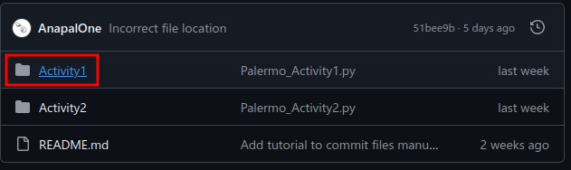
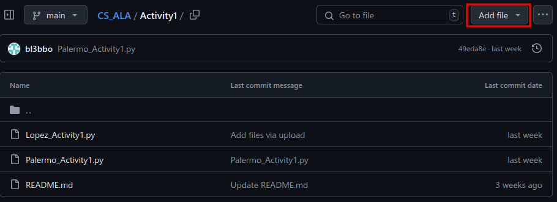
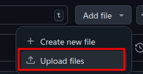
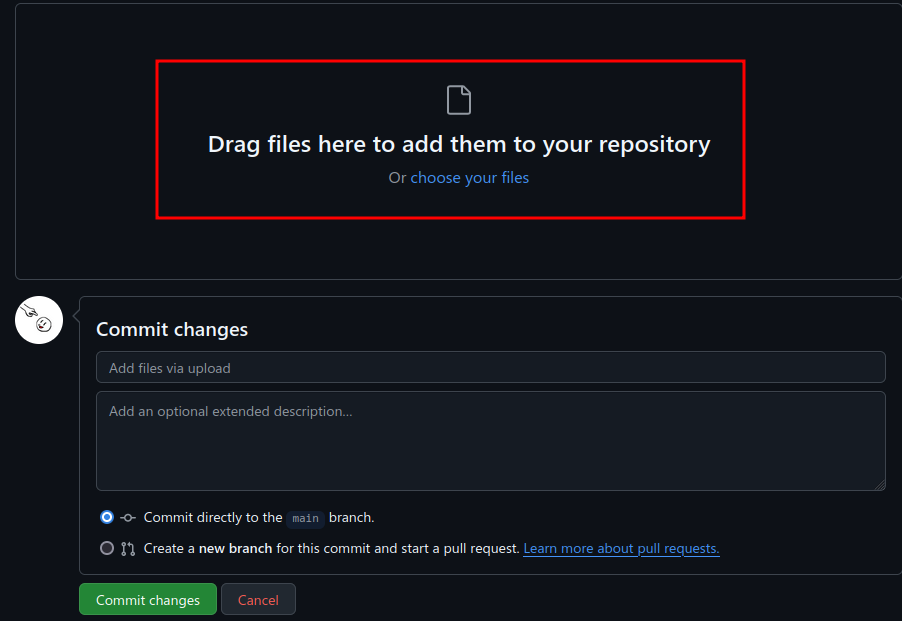
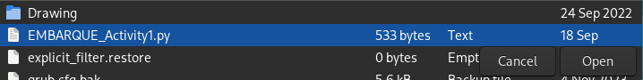
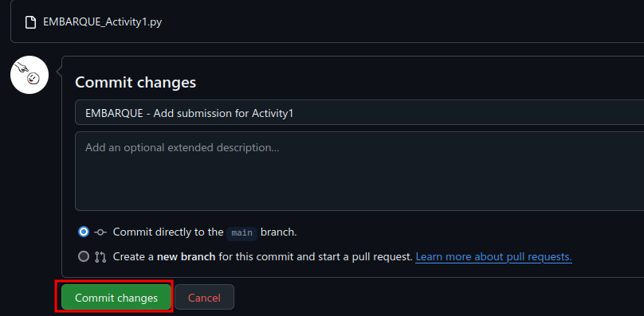

  <h1>CS ALP GitHub</h1>

Welcome to the GitHub repository for our ALP!  
This repositories stores all of your references, logs, activities, and assignments.  

Each activity will have their own respective folder where you will submit your assignments and activities.

## Q&A
#### **How do I submit?**
There are two ways that you can submit:

  
Using the GitHub site

   

  <ol>
    <li>
      Go to the respective folder for an activity.  
      
      

    </li>
    <li>
      Click the `Add file` button on the top right. 
      
      

    </li>
    <li>
      Select the `Upload files` option.  
        
      > Optionally, you can select the `Create new file` option and write your code there.
      

    </li>
    <li>
      Select your file and upload it.  
        
      
      

    </li>
    <li>
      Make a commit message that includes your last name and commit.  
      
    </li>
  </ol>

  
Manually through the terminal

   
  <ol>
    <li> Create a folder of your choosing.</li>
    <li>
      <a href="https://git-scm.com/download/win"> Install Git on your Windows system. </a> 
      If you're using Arch Linux, run <code>sudo pacman -S git</code>
    </li>
    <li>
      Run these commands to initialize your Git folder and to copy this repository.
      <pre><code>
        git init
        git clone https://github.com/CS-ALP/CS-ALP.git
      </code></pre>
    </li>
    <li>
      Now add your files to the folder. For example, if you want to add the file `Hello`, do
      <pre><code>
        git add hello
      </code></pre>
    </li>
    <li>
      Commit your changes and push them to this repository.
      <pre><code>
        git commit -m "First commit. Hello CS-ALP!"
        git push
      </code></pre>
    </li>
    <li>
      To update your files whenever a new change is committed by someone else, do
      <pre><code>
        git pull
      </code></pre>
    </li>
  </ol>

## Other
If you have any questions or suggestions, please ask on the CS ALA Messenger group chat or DM me directly on Messenger.

  Repository created by: @Andrei Jose R. Embarque

